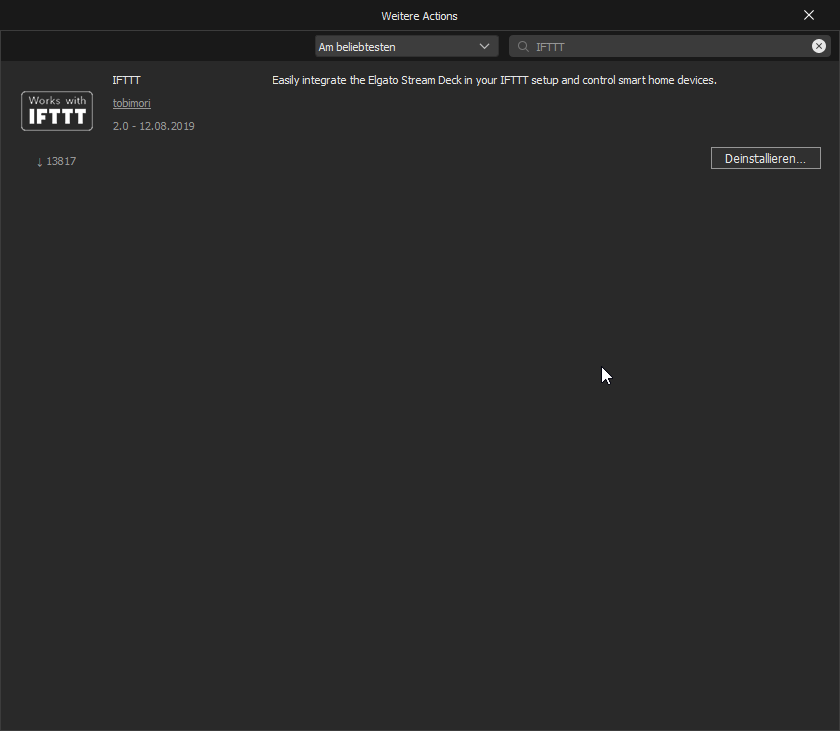
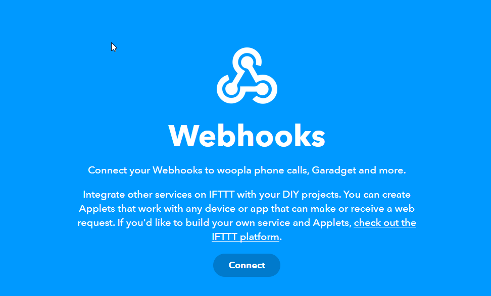

  

  
  

  Easily integrate the <a href="https://www.elgato.com/en/gaming/stream-deck">Elgato Stream Deck</a> in your <a href="https://ifttt.com/">IFTTT</a> setup and control smart home devices.

___

# 📝 Guide

> If you know how IFTTT Webhooks work, this tutorial is rather obsolete for you. Just enter the Event Name and the Maker Key in the property inspector of your action and you'll be ready to go.

## 🚀 Getting started
1. Download the integration from the Stream Deck Store.

2. Navigate to IFTTT's website, [IFTTT.com](https://ifttt.com). Create a new account if you haven't done that yet. Then, visit the [Webhooks service site](https://ifttt.com/maker_webhooks) and connect your account by clicking on "Connect".

## 📲 Create an action
