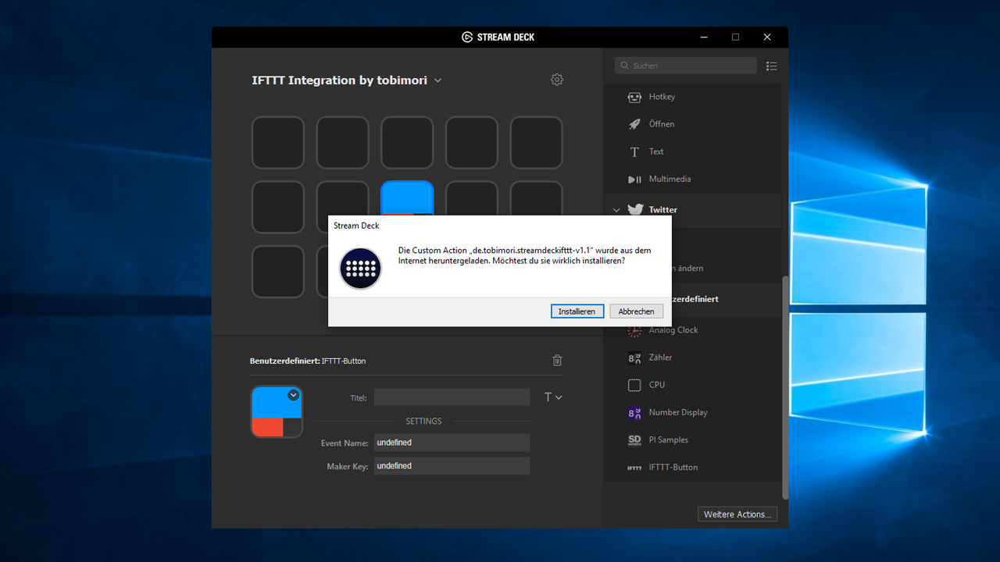
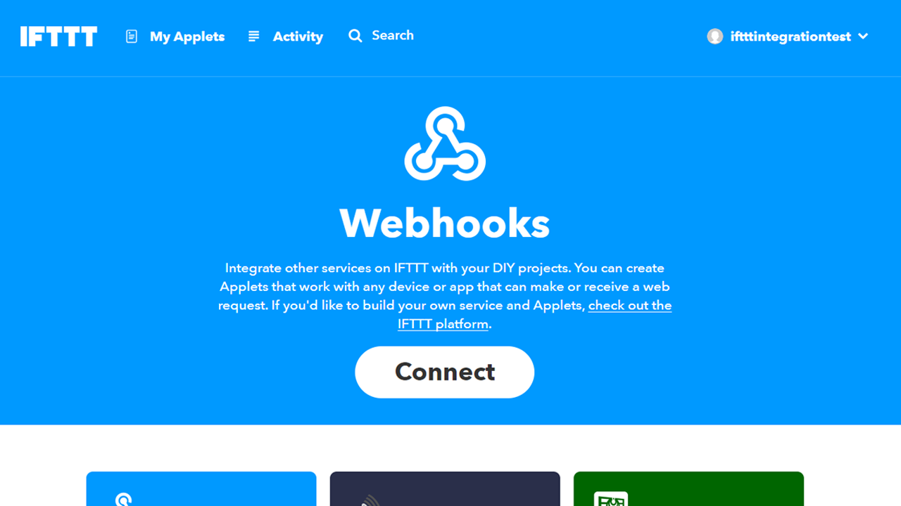
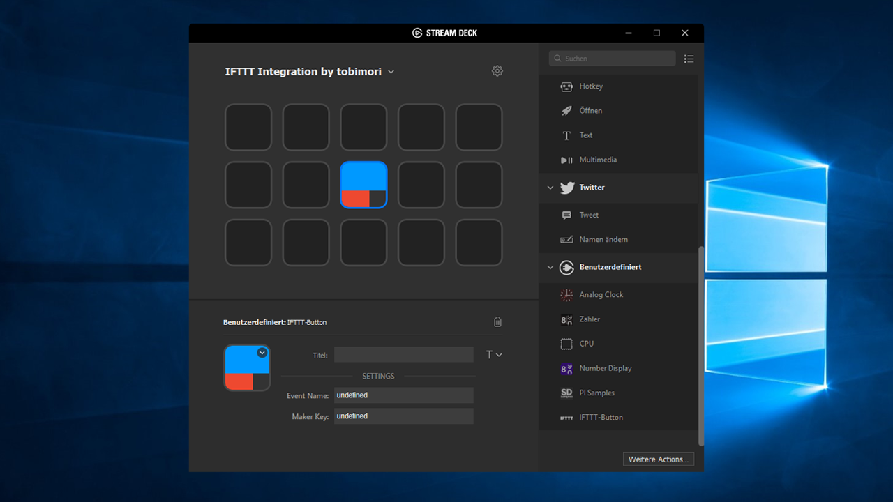
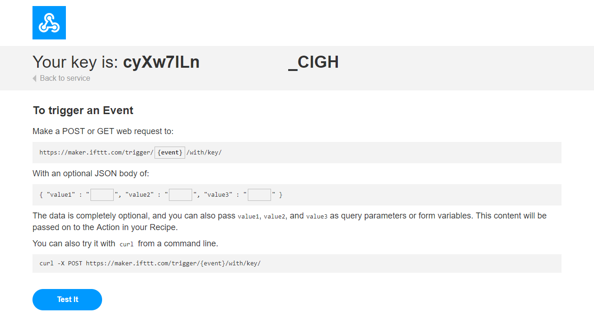
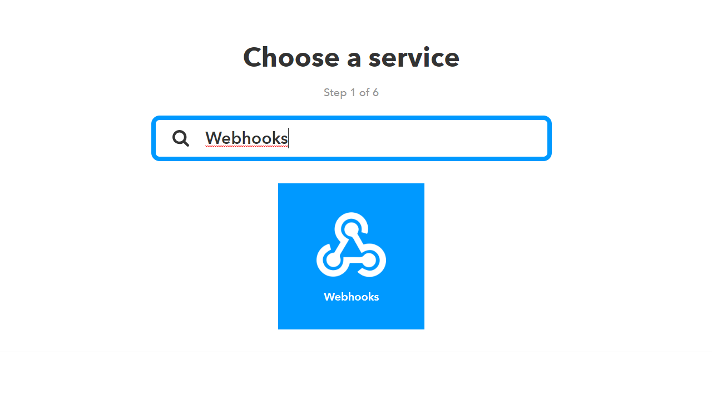
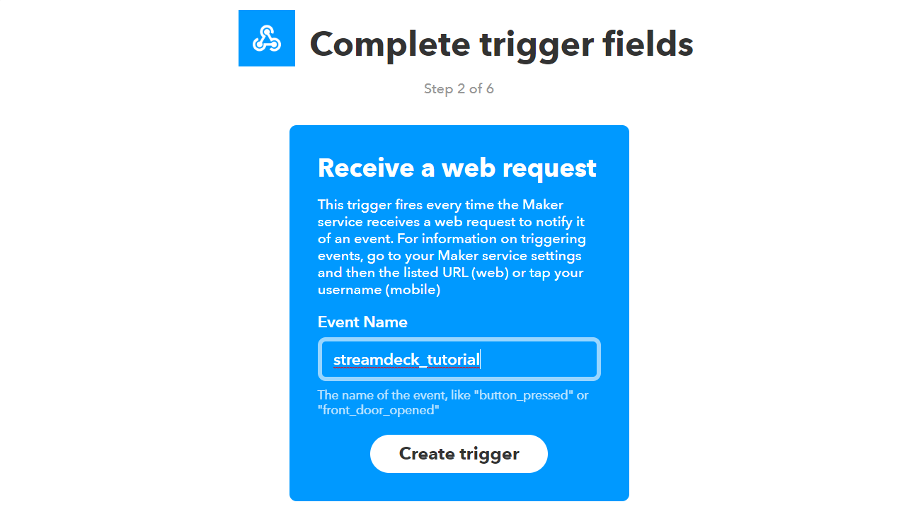
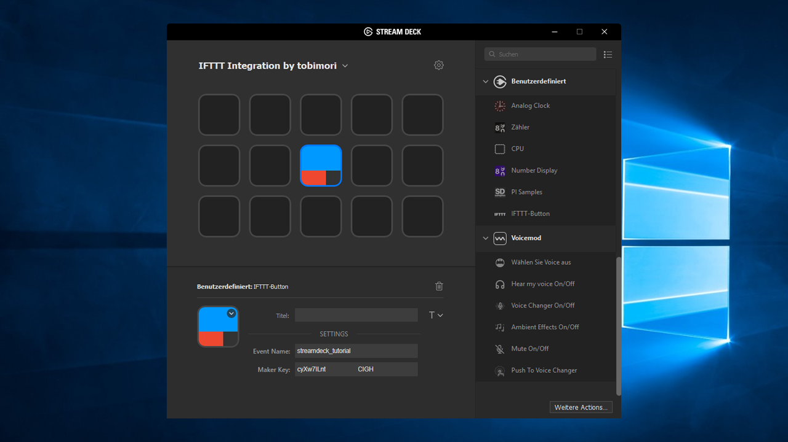

> Easily integrate the Elgato Stream Deck in your IFTTT setup and control smart home devices.

## How to use

If you know how IFTTT Webhooks work, this tutorial is rather obsolete for you. Just enter the Event Name and the Maker Key in the property inspector of your action and you'll be ready to go.

### General installation and setup
Download the latest release [here](https://github.com/tobimori/streamdeck-ifttt/releases/latest "Hello from the other side...") and execute the file. The Stream Deck software should ask you to continue the installation.

Click on install and navigate to IFTTT's website, [IFTTT.com](https://ifttt.com).
Create a new account if you haven't done that yet. 

To continue with the setup, you need to connect your IFTTT account to the Maker Webhooks service. Search for the service or visit the corresponding website [here](https://ifttt.com/services/maker_webhooks) and click on "Connect".

### Creating a new action/applet

Drag and drop the IFTTT button action from the actions list to the canvas area.
After selecting it, you'll see two important settings in the property inspector. 

The Event Name setting defines the Event that will be called on IFTTT. We will get to that later on.

The second setting, the Maker Key, is basically an access key for your IFTTT account. To see your Maker Key, go on the [Maker Webhooks services]() page and click on Documentation. You'll find your Maker Key right there.

Copy the Maker Key into the property inspector. Then, go back to the IFTTT page and [create a new applet](https://ifttt.com/create). This is how actions are called on IFTTT. 

Click on "[+] this" and search for Webhooks.

Select the "Receive a web request" trigger and enter the decided Event Name for this applet. This also needs to be entered in the property inspector of your action. If two applets have the same Event Name, they will both trigger when pressing the corresponding stream deck button.

Click on create trigger and switch into the Elgato Stream Deck software. Enter the Event Name in the property inspector. Your property inspector panel now should look like this.

You can now switch back to IFTTT's page and choose the action service like you want. Examples for this are controlling Phillips Hue lamps or resuming your Sonos speaker.

#### Have fun with your new Smart home-enabled Stream Deck! 
