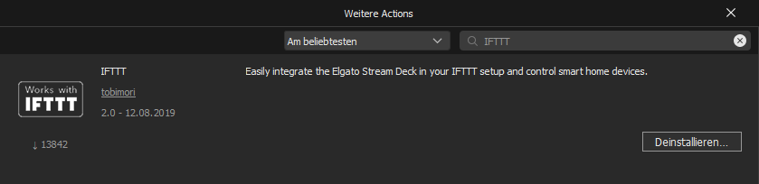
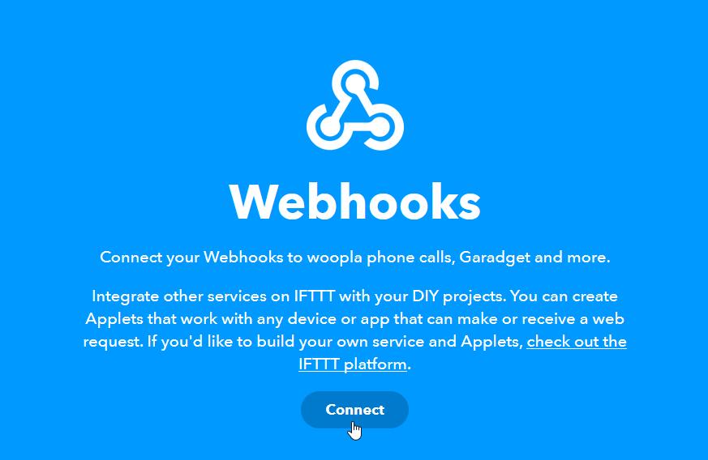
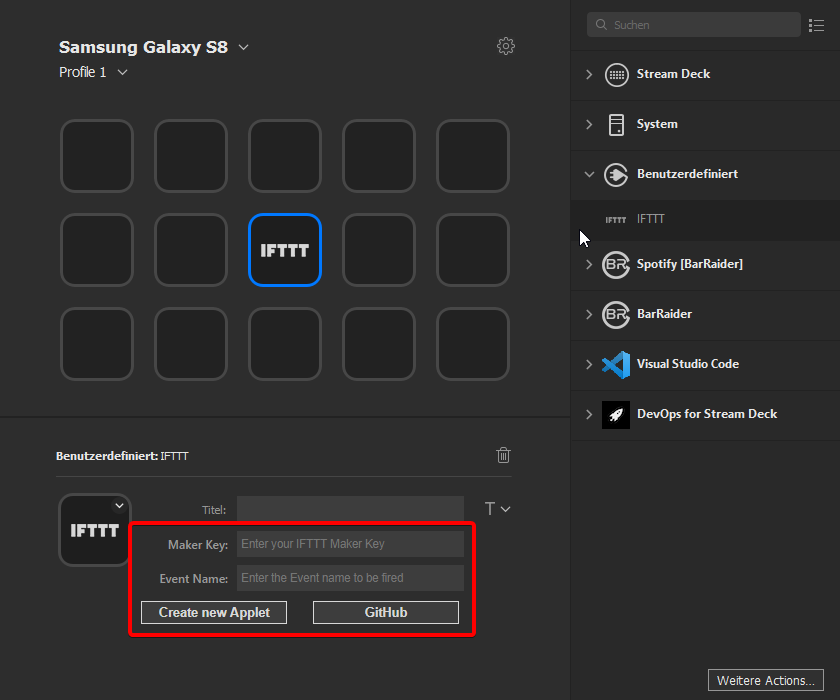
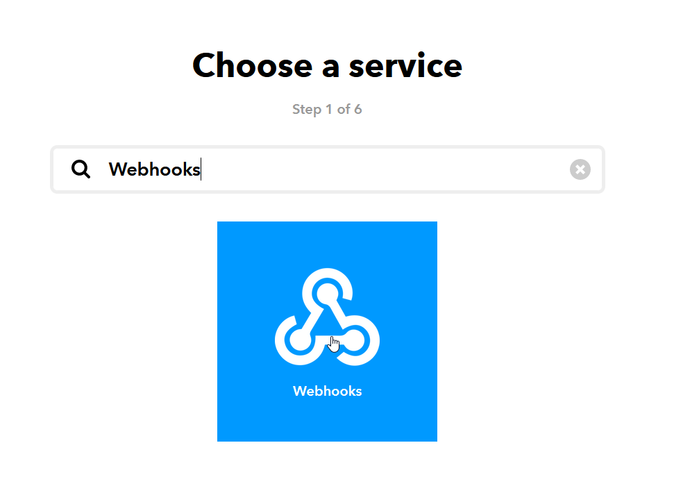
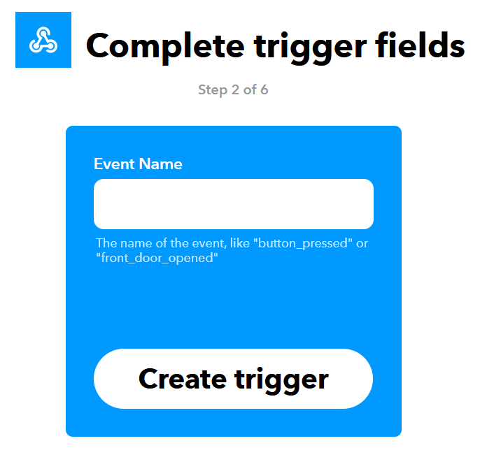
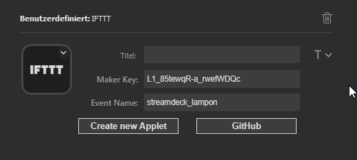

  

  
  
  
   

  Easily integrate the <a href="https://www.elgato.com/en/gaming/stream-deck">Elgato Stream Deck</a> in your <a href="https://ifttt.com/">IFTTT</a> setup and control smart home devices.

___

# 📝 Guide

> If you know how IFTTT Webhooks work, this tutorial is rather obsolete for you. Just enter the Event Name and the Maker Key in the property inspector of your action and you'll be ready to go.

Download the integration from the Stream Deck Store.

Navigate to IFTTT's website, [IFTTT.com](https://ifttt.com). Create a new account if you haven't done that yet. Then, visit the [Webhooks service site](https://ifttt.com/maker_webhooks) and connect your account by clicking on "Connect".

Drag and drop the IFTTT button action from the actions list to the canvas area. After selecting it, you'll see two important settings in the property inspector.

The Event Name setting defines the Event that will be called on IFTTT. *We'll get to that later.*

The Maker Key is an access key for your IFTTT account. To get your Maker Key, go on the [Webhooks service site](https://ifttt.com/maker_webhooks) and click on Documentation. You'll find your Maker Key right there. You only need to set this once, the key is saved for all actions.

Copy the Maker Key into the property inspector. Then, go back to the IFTTT page and create a new applet. This is how actions are called on IFTTT.

Click on "[+] this" and search for Webhooks.

Select the "Receive a web request" trigger and enter the decided Event Name for this applet. This also needs to be entered in the property inspector of your action. If two applets have the same Event Name, they will both trigger when pressing the corresponding stream deck button.

Click on create trigger and switch into the Elgato Stream Deck software. Enter the Event Name in the property inspector. Your property inspector panel now should look like this.

You can now switch back to IFTTT's page and choose the action service like you want. Examples for this are controlling LIFX lamps or resuming your Sonos speaker.

**Have fun with your new Smart home-enabled Stream Deck!**

# 📞 Help

Feel free to ask your questions on the [Elgato Discord Server](https://discord.com/invite/elgato). Please use GitHub Issues for reporting bugs.

# 📄 License

streamdeck-ifttt is licensed under the [MIT License](LICENSE).
